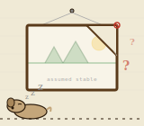

# Jack's Claude Code Plugins


Skills that make Claude stop and think before acting — model the system, check the data, extract the content.

## Installation

Add the marketplace, then install any plugin:

```
/plugin marketplace add https://github.com/jackwillis/claude-plugins.git
```

Reboot Claude after installing plugins to load new skills.

## Plugins

### Systems Analysis

```
/plugin install systems-analysis@jackwillis
```


AI coding agents are biased toward action. They'll try a fix before understanding why something broke, add more rules when the problem is that rules can't keep up, or draw causal conclusions from correlations. These are the same mistakes humans make, just faster.

This plugin adds four skills that enforce one shared discipline: **model the system before intervening.** Skills activate automatically when Claude detects a matching situation, and can also be invoked directly.

#### Representing and Intervening

```
/representing-and-intervening
```


State what you think is happening, predict what you should see, then test one thing at a time. Forces you to enumerate available tests (script runner, spec, logs, query inspection) before grabbing the first one. When a prediction fails, asks whether the model is structurally wrong or just miscalibrated — the difference between rethinking your approach and tuning a parameter.

**Use when:** "why is this happening", "help me debug", unexplained gaps between expected and observed behavior. Based on Hacking (1983), Schon (1983), Argyris & Schon (1978).

#### Requisite Variety

```
/requisite-variety
```


When a control system keeps failing despite more rules, more alerts, more checks — this skill asks whether the controller has enough response variety to match its disturbances, whether it contains a model of what it's controlling, and whether you can find structure in the problem that makes it tractable. Three principles applied in order: capacity, then structure, then constraints.

**Use when:** "why can't we control this", regulation failure, alert fatigue, whack-a-mole against adaptive adversaries. Based on Ashby (1956), Conant & Ashby (1970).

#### Design a Causal Study

```
/design-causal-study
```


Before claiming X causes Y, define exactly what you're measuring, draw the causal structure, and check whether the data can actually answer the question. Seven steps that prevent the most common errors: adjusting for variables on the causal path, conditioning on colliders, and skipping the estimand entirely.

**Use when:** "does X cause Y", "should we change X to improve Y", drawing conclusions from observational data. Based on Pearl & Mackenzie (2018).

#### The Frame Problem

```
/frame-problem
```



Every action and every line of reasoning assumes a frame — things you take to stay the same. This skill forces you to make those assumptions explicit so they can be checked. Name what you're holding constant, check whether it's still true, question whether you're solving the right problem, and admit what your current vocabulary can't see. Recognizes three failure modes from Dennett's robot thought experiment: ignoring side effects (R1), considering everything (R1D1), and meta-paralysis over relevance (R2D1).

**Use when:** stale state, inherited problem framing, confidence without re-verification, any gap between when information was gathered and when it's being used. Based on Fodor (1987), Dennett (1984), Hayes (1973).

#### Transitions

Each skill includes transition signals that hand off to the others when the situation shifts. Debugging may reveal a regulation problem; regulation may need causal evidence; a causal question may turn out to be "why is this behaving this way"; and at any point, assumptions may have gone stale without being re-examined. The frame-problem skill cuts across the other three — it fires whenever an agent's implicit assumptions about what hasn't changed might be wrong, regardless of which skill is currently active.

#### Works well with Superpowers

```
/plugin install superpowers@claude-plugins-official
```

These skills focus on *when to stop and think* — they don't manage plans, tasks, or execution. For that, pair them with [Superpowers](https://github.com/obra/superpowers):

- **Brainstorming** — explore the problem space before committing to an approach. Systems-analysis skills then pressure-test whatever direction you choose.
- **Writing Plans** — turn your model into a structured plan. Representing and Intervening builds the model; Writing Plans turns it into steps.
- **Executing Plans** — execute with review checkpoints. The analysis skills catch when execution reveals a wrong model.


### Text Utils

```
/plugin install text-utils@jackwillis
```


Three skills for getting text in and out of formats without wasting context. Themes are customizable — edit the shipped CSS or drop in your own. Requires `pandoc`, `weasyprint`, `poppler` (for `pdftotext`). Optional: `tesseract` (OCR), `trafilatura` (article extraction).

```bash
brew install pandoc weasyprint poppler qpdf # core
brew install tesseract                      # optional: OCR
pipx install trafilatura                    # optional: article extraction
```

#### Fetch Markdown

```
/fetch-markdown
```


Get clean markdown from a URL. Tries a markdown proxy, then trafilatura for article extraction, then local pandoc conversion, then lynx as a plaintext fallback. Uses significantly less context than WebFetch.

**Use when:** fetching web content for analysis, summarization, or reference.

#### Markdown to PDF

```
/markdown-to-pdf
```


Render markdown to styled PDF using pandoc + weasyprint + CSS. Ships with three themes (default, editing, correspondence) with cross-platform font stacks. Edit the CSS or drop in your own.

**Use when:** "make a PDF", "printable version", "export as PDF".

#### Read PDF

```
/read-pdf
```


Extract text from PDFs. Tries `pdftotext` first (fast, digital PDFs), falls back to OCR via `tesseract` for scanned documents. Detects which is needed automatically.

**Use when:** "read this PDF", "extract text", scanned documents, image-heavy PDFs.

## License

[MIT](LICENSE)
