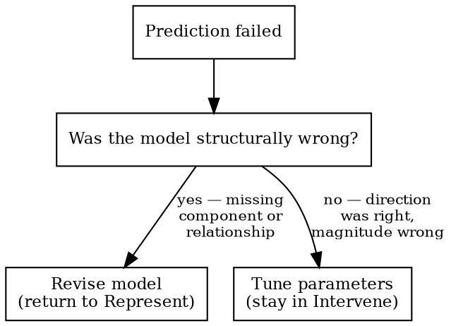

# Representing and Intervening

You must model a system before predicting its behavior, and predict before intervening. Source: Ian Hacking, *Representing and Intervening*.

## Five Phases

| Phase | Action | Gate |
|-------|--------|------|
| **Represent** | State the model: components, relationships, assumptions | — |
| **Predict** | What should we observe? Write it down. | No intervention without written prediction |
| **Intervene** | Pick one test from the repertoire. Compare result to prediction. | One variable at a time |
| **Observe** | Record actual vs. predicted | — |
| **Update** | Prediction wrong? → See Update Decision | — |

**Hard gate:** No fix, bypass, or diagnostic action without first stating what you expect and why.

## Two Modes

- **Lightweight (default):** Natural language model and predictions. Always start here.
- **Formal (opt-in):** Tool-assisted (e.g., causal diagrams, logic engines). Only after lightweight model exists.

## Intervention Repertoire

Before picking a test, enumerate what's available: REPL/console, write a spec, read logs, inspect generated queries, add instrumentation, run a benchmark. The first one you think of is rarely the most informative. Pick the one that most directly tests the prediction.

## Problem Setting (Schon)

Before acting on a diagnosis, are you solving the right problem, or the wrong problem correctly? LLMs agree with user framing 88% of the time (Cheng et al., 2025) — if the user says "I think it's a caching issue," the agent will debug caching rather than questioning the frame. Trace the assumption chain to its deepest dependency. Present the human with one pointed question — not the whole chain.

## Understanding, Not Just Receiving

The human must be able to explain the diagnosis in their own words before acting on it. If they can't, the tool replaced their understanding rather than augmenting it. A diagnosis the human can't explain is a diagnosis they can't update when conditions change.

## Update Decision

Tune parameters = single-loop learning. Revise the model = double-loop learning (Argyris). Ashby's Law: if the model can't represent the system's variety, no parameter adjustment will fix it.

## Red Flags

Stop and return to Represent if you catch yourself:
- "Let me just try..." (intervening without predicting)
- Reaching for a tool before the human has spoken
- "Close enough" (skipping the observe/update cycle)
- Multiple simultaneous changes (uninterpretable results)
- "It partially worked, let's tune" (may be structural, not parametric)
- Ranking fixes by probability without stating the model they assume

## Rationalizations

| Thought | Reality |
|---------|---------|
| "Trying IS learning" | Predict first, then the result teaches. Without prediction, results are noise. |
| "The tool will figure it out" | No model in → no insight out. |
| "Close enough" | Wrong in a way you haven't identified yet. |
| "The model is implicit" | Implicit models can't be checked or updated. Write it down. |
| "Predicting is overhead" | 30 seconds to predict vs. hours of undirected intervention. |
| "Let me give you a checklist" | Checklist = intervention without representation. Model first. |
| "The user said it's X" | Agreement ≠ diagnosis. Check the frame. |

## Transition Signals

- **Model reveals a regulation problem** (regulator can't match disturbance variety, "we keep adding rules") → switch to **requisite-variety**.
- **Represent phase needs causal structure from observational data** (confounders, selection bias) → switch to **design-causal-study**.
- **Production is down, what broke?** → use **systematic-debugging** (forensic, not epistemic).

R&I is epistemic: *how does this work, and what will happen if I change it?*
