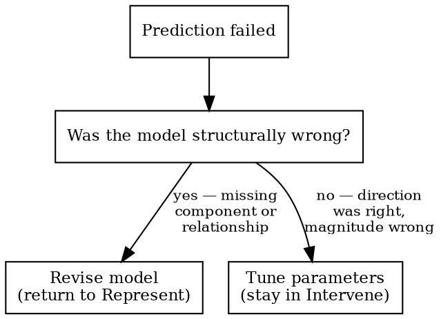

# Representing and Intervening

You must model a system before predicting its behavior, and predict before intervening. Source: Ian Hacking, *Representing and Intervening*.

## Proportionality

Not every question needs the full cycle. If the system is well-understood, the failure mode is familiar, and you can state your model and prediction in one sentence each — do that and act. The discipline is *having* a model before intervening (Hacking), not the ceremony around it. Scale the formality to the cost of being wrong.

## Five Phases

| Phase | Action | Gate |
|-------|--------|------|
| **Represent** | State the model: components, relationships, assumptions. Then ask: *what else could explain these observations?* State an alternative model if one is plausible. If nothing credible competes, say why in one sentence — that sentence is the value. | — |
| **Predict** | What should we observe? Write it down. What part of your model are you least confident about? Target that first. | No intervention without written prediction |
| **Intervene** | Pick one test from the repertoire. If you have competing models, prefer the test that distinguishes them. If not, prefer the test that most directly falsifies your single model. Compare result to prediction. | One variable at a time |
| **Observe** | Record actual vs. predicted | — |
| **Update** | Prediction wrong? → See Update Decision | — |

**Hard gate:** No fix, bypass, or diagnostic action without first stating what you expect and why.

## Two Modes

- **Lightweight (default):** Natural language model and predictions. Always start here.
- **Formal (opt-in):** Tool-assisted (e.g., causal diagrams, logic engines). Only after lightweight model exists. Formal mode is for research, scientific, or regulatory contexts where the model needs to survive external scrutiny — not typical software engineering.

## Intervention Repertoire

Before picking a test, enumerate what's available: script runner, write a spec, read logs, inspect generated queries, add instrumentation, run a benchmark. The first one you think of is rarely the most informative. Pick the one that most directly tests the prediction.

**Prefer executable verification.** If a claim can be checked by running code — a test, a query, a count, a timing measurement — do that instead of reasoning about it in prose. Computed results are more reliable than inferred ones.

## Problem Setting (Schon)

Are you solving the right problem, or the wrong problem correctly? The Predict gate catches "fixing without predicting" but not "predicting the answer to the wrong question."

**Frame-agreement gate:** If the user provides a diagnosis ("I think it's a caching issue," "the deploy broke it"), state one alternative explanation that would produce the same symptoms before proceeding. One alternative, not an exhaustive audit. If you can't think of one, say so — that's informative too.

LLMs agree with user framing 88% of the time (Cheng et al., 2025). The result: the user says "caching issue" and the model builds a correct, detailed model of a caching problem that doesn't exist. The Represent phase then produces a plausible alternative model — of the wrong problem. The frame-agreement gate fires earlier, before modeling starts, and questions the problem definition itself.

**Fast exit:** If the user's diagnosis is obviously correct (they have logs, a stack trace, or direct evidence), the gate costs one sentence: "The stack trace points to X and no other component touches this path."

## Understanding, Not Just Receiving

The human must be able to explain the diagnosis in their own words before acting on it. If they can't, the tool replaced their understanding rather than augmenting it. A diagnosis the human can't explain is a diagnosis they can't update when conditions change.

## Update Decision

Tune parameters = single-loop learning. Revise the model = double-loop learning (Argyris). Ashby's Law: if the model can't represent the system's variety, no parameter adjustment will fix it.

## Red Flags

Stop and return to Represent if you catch yourself:
- "Let me just try..." (intervening without predicting)
- Reaching for a tool before the human has spoken
- "Close enough" (skipping the observe/update cycle)
- Multiple simultaneous changes (uninterpretable results)
- "It partially worked, let's tune" (may be structural, not parametric)
- Ranking fixes by probability without stating the model they assume
- Accepting the user's diagnosis and starting to model it (frame-agreement gate not checked)

## Rationalizations

| Thought | Reality |
|---------|---------|
| "Trying IS learning" | Predict first, then the result teaches. Without prediction, results are noise. |
| "The tool will figure it out" | No model in → no insight out. |
| "Close enough" | Wrong in a way you haven't identified yet. |
| "The model is implicit" | Implicit models can't be checked or updated. Write it down. |
| "Predicting is overhead" | 30 seconds to predict vs. hours of undirected intervention. |
| "Let me give you a checklist" | Checklist = intervention without representation. Model first. |
| "The user said it's X" | Agreement ≠ diagnosis. State one alternative before accepting. |

## Examples

- [Flaky integration test](examples/flaky-test.md) — competing models (insertion order vs. race condition), executable verification
- [API latency spike](examples/slow-api.md) — competing models (N+1 vs. index), query counting to distinguish them
- [Design decision: queue vs. database](examples/design-decision.md) — competing approaches (not debugging), observability as the differentiator

## Arriving From Another Skill

- **From staleness-check:** You re-read stale information and found it changed. Carry the updated state into your Represent phase rather than building on the old read.
- **From causal-analysis:** You have a DAG and identified causal relationships. Use them as your model in Represent rather than building from scratch. Your prediction should test the edges you're least confident about.
- **From requisite-variety:** You've identified a variety gap or regulation failure. The regulation model is your starting Represent — now ask *why* the regulator fails, which is an R&I question.

## Transition Signals

- **Model reveals a regulation problem** (regulator can't match disturbance variety, "we keep adding rules") → suggest **requisite-variety** to the user.
- **Represent phase needs causal structure from observational data** (confounders, selection bias) → suggest **causal-analysis** to the user.
- **Production is down, what broke?** → suggest **systematic-debugging** to the user (forensic, not epistemic).
- **Update reveals structural revision** — the model was wrong, not miscalibrated. If **brainstorming** is available, suggest it to the user to explore the problem space before committing to a new model.
- **Acting on information that may have changed** — turns have passed or the user acted since your last read → suggest **staleness-check** to the user.
- **Model is solid, intervention plan is clear** — if **writing-plans** is available, suggest it to the user. For multi-step fixes, suggest **executing-plans** or **subagent-driven-development**.
- **Prediction is clear and you need to encode it as a test** — if **what-to-test** is available, suggest it to the user. R&I's prediction becomes the test's causal claim.

R&I is epistemic: *how does this work, and what will happen if I change it?*
